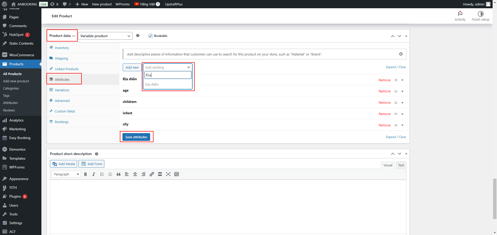

import Tabs from '@theme/Tabs';
import TabItem from '@theme/TabItem';

:::danger[Lưu ý!]

Xem video hướng dẫn đăng bài (*cách đăng tương tự*), **lưu ý chọn đúng loại là `Car Rental`**. Vui lòng xem hướng dẫn chi tiết bằng hình ảnh ở mục bên dưới.

:::

<iframe width="100%" style={{"aspect-ratio": "16 / 9"}} src="https://www.youtube.com/embed/plraw6fc7w8" title="YouTube video player" frameborder="0" allow="accelerometer; autoplay; clipboard-write; encrypted-media; gyroscope; picture-in-picture; web-share" referrerpolicy="strict-origin-when-cross-origin" allowfullscreen></iframe>

## CÁC MỤC CẦN LƯU Ý

### 1. Tùy chọn loại sản phẩm & danh mục

    :::danger[Lưu ý!]
    <Tabs>
    <TabItem value="Loại sản phẩm" label="Loại sản phẩm">Product Format phải chọn là `Car Rental`.</TabItem>
    <TabItem value="Danh mục" label="Danh mục">Danh mục chọn theo khu vực. VD: `KV Miền Bắc`.</TabItem>
    </Tabs>
    :::

    

### 2. Tổng quan

    :::danger[Lưu ý!]
    <Tabs>
    <TabItem value="Cách trình bày" label="Cách trình bày">Chọn cách trình bày là `v2`.</TabItem>
    <TabItem value="Các mục khác" label="Các mục khác">Nhập Khoảng cách, Tiêu thụ nhiên liệu, Lịch sự kiện (năm sản xuất xe), Video.</TabItem>
    </Tabs>
    :::

    
    
### 3. Vị trí

    :::danger[Lưu ý!]
    <Tabs>
    <TabItem value="Vị trí hiển thị" label="Vị trí hiển thị">Điền chính xác vị trí của cho thuê xe tại đây.</TabItem>
    <TabItem value="Bản đồ vị trí" label="Bản đồ vị trí">Điền chính xác vị trí của cho thuê xe tại đây.</TabItem>
    </Tabs>
    :::

    

### 4. Đặc điểm kỹ thuật

    :::danger[Lưu ý!]
    Điền các đặc điểm kỹ thuật của xe. VD: như hãng. model, .v.v
    :::

    

### 5. Thêm địa điểm vào khung search

    

    :::danger[Lưu ý!]
    Tại mục **Product data** ➡️ **Attributes** ➡️ **Địa điểm** ➡️ điền thông tin địa điểm (nếu tìm không thấy có thể tạo trực tiếp bằng cách nhấn `Enter`).
    :::

    

    