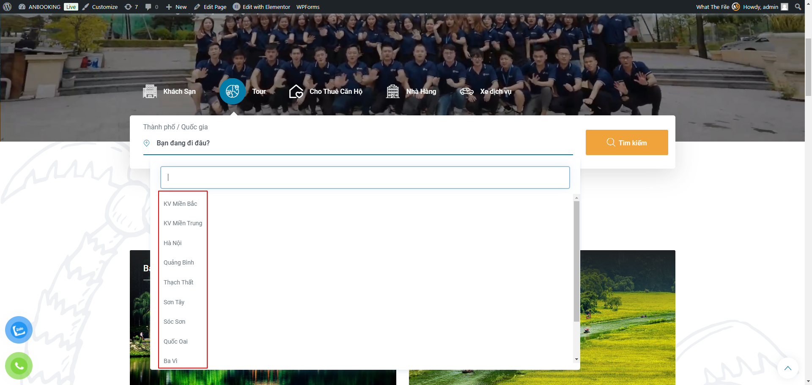

import Tabs from '@theme/Tabs';
import TabItem from '@theme/TabItem';

:::note

Xem video hướng dẫn & hướng dẫn chi tiết ở các mục bên dưới.

:::

<iframe width="100%" style={{"aspect-ratio": "16 / 9"}} src="https://www.loom.com/embed/66bc3d167010429b9084b30259815359?sid=c5ad2fbd-2b9d-4ce0-946c-9a299d5c8495" title="YouTube video player" frameborder="0" allow="accelerometer; autoplay; clipboard-write; encrypted-media; gyroscope; picture-in-picture; web-share" referrerpolicy="strict-origin-when-cross-origin" allowfullscreen></iframe>

## CÁC MỤC CẦN LƯU Ý

### 1. Tùy chọn loại sản phẩm & danh mục

    :::danger[Lưu ý!]
    <Tabs>
    <TabItem value="Loại sản phẩm" label="Loại sản phẩm">Product Format phải chọn là `Hotel`.</TabItem>
    <TabItem value="Danh mục" label="Danh mục">Danh mục chọn theo khu vực. VD: `Khách sạn/Miền Trung/Quảng Bình`.</TabItem>
    </Tabs>
    :::

    

### 2. Tổng quan

    :::danger[Lưu ý!]
    Chọn cách trình bày là `v3`
    :::

    

### 3. Huy hiệu

    :::danger[Lưu ý!]
    Tích vào các ô cần thiết
    :::

    
    
### 4. Vị trí

    :::danger[Lưu ý!]
    <Tabs>
    <TabItem value="Thẻ vị trí" label="Thẻ vị trí">Tích vào các ô cần thiết</TabItem>
    <TabItem value="Vị trí hiển thị" label="Vị trí hiển thị">Điền chính xác vị trí của khách sạn tại đây.</TabItem>
    <TabItem value="Bản đồ vị trí" label="Bản đồ vị trí">Điền chính xác vị trí của khách sạn tại đây.</TabItem>
    <TabItem value="Những thứ cần thiết gần nhất" label="Những thứ cần thiết gần nhất">Airports, Public transportation, Drive, .v.v có thể điền hoặc bỏ qua.</TabItem>
    <TabItem value="Địa danh" label="Địa danh">Popular Landmarks (địa danh nổi tiếng), Nearby Landmarks (Các địa danh gần đó),.v.v có thể điền hoặc bỏ qua, khuyến khích điền.</TabItem>
    </Tabs>
    :::

    

### 5. Tiện nghi

    :::danger[Lưu ý!]
    Tích vào các ô cần thiết
    :::

    

### 6. Chính sách khách hàng

    :::danger[Lưu ý!]
    Thiết lập các chính sách như giờ nhận/trả phòng, chính sách trẻ em, giường phụ, .v.v
    :::

    
    
### 7. Sự thật

    :::danger[Lưu ý!]
    Thiết lập các Di chuyển xung quanh, Tài sản, Tiện ích bổ sung, Xếp hạng sao vàng.
    :::

    

### 8. Thêm địa điểm vào khung search

    

    :::danger[Lưu ý!]
    Tại mục **Product data** ➡️ **Attributes** ➡️ **Địa điểm** ➡️ điền thông tin địa điểm (nếu tìm không thấy có thể tạo trực tiếp bằng cách nhấn `Enter`).
    :::

    

    