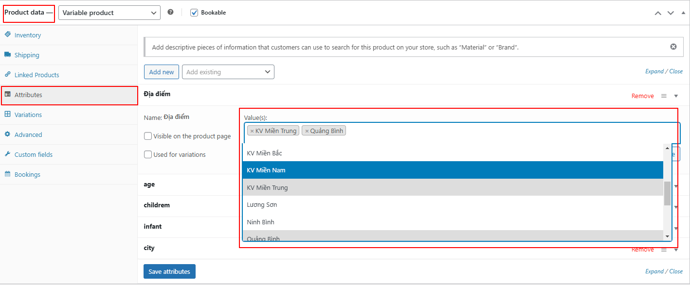

import Tabs from '@theme/Tabs';
import TabItem from '@theme/TabItem';

:::note

Xem video hướng dẫn & hướng dẫn chi tiết ở các mục bên dưới.

:::

<iframe width="100%" style={{"aspect-ratio": "16 / 9"}} src="https://www.loom.com/embed/66bc3d167010429b9084b30259815359?sid=c5ad2fbd-2b9d-4ce0-946c-9a299d5c8495" title="YouTube video player" frameborder="0" allow="accelerometer; autoplay; clipboard-write; encrypted-media; gyroscope; picture-in-picture; web-share" referrerpolicy="strict-origin-when-cross-origin" allowfullscreen></iframe>

## CÁC MỤC CẦN LƯU Ý

### 1. Tùy chọn loại sản phẩm & danh mục

    :::danger[Lưu ý!]
    <Tabs>
    <TabItem value="Loại sản phẩm" label="Loại sản phẩm">Product Format phải chọn là `Yacht`.</TabItem>
    <TabItem value="Danh mục" label="Danh mục">Danh mục chọn theo khu vực. VD: `Restaurant/Quảng Bình/Đồng Hới`.</TabItem>
    </Tabs>
    :::

    

### 2. Tổng quan

    :::danger[Lưu ý!]
    Chọn cách trình bày là `v2`.
    :::

    
    
### 3. Vị trí

    :::danger[Lưu ý!]
    <Tabs>
    <TabItem value="Vị trí hiển thị" label="Vị trí hiển thị">Điền chính xác vị trí của nhà hàng tại đây.</TabItem>
    <TabItem value="Bản đồ vị trí" label="Bản đồ vị trí">Điền chính xác vị trí của nhà hàng tại đây.</TabItem>
    </Tabs>
    :::

    

### 4. Thêm địa điểm vào khung search

    

    :::danger[Lưu ý!]
    Tại mục **Product data** ➡️ **Attributes** ➡️ **Địa điểm** ➡️ điền thông tin địa điểm (nếu tìm không thấy có thể tạo trực tiếp bằng cách nhấn `Enter`).
    :::

    

    