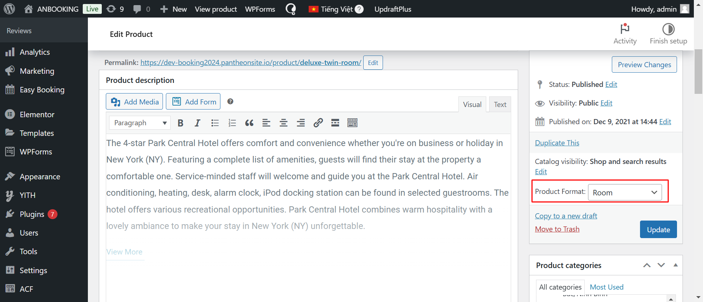

import Tabs from '@theme/Tabs';
import TabItem from '@theme/TabItem';

:::danger[Lưu ý!]

Xem video hướng dẫn đăng bài (*cách đăng tương tự*), **lưu ý chọn đúng loại là `Room`**. Vui lòng xem hướng dẫn chi tiết bằng hình ảnh ở mục bên dưới.

:::

<iframe width="100%" style={{"aspect-ratio": "16 / 9"}} src="https://www.youtube.com/embed/plraw6fc7w8" title="YouTube video player" frameborder="0" allow="accelerometer; autoplay; clipboard-write; encrypted-media; gyroscope; picture-in-picture; web-share" referrerpolicy="strict-origin-when-cross-origin" allowfullscreen></iframe>

## CÁC MỤC CẦN LƯU Ý

### 1. Tùy chọn loại sản phẩm & danh mục

    :::danger[Lưu ý!]
    <Tabs>
    <TabItem value="Loại sản phẩm" label="Loại sản phẩm">Product Format phải chọn là `Room`.</TabItem>
    <TabItem value="Danh mục" label="Danh mục">Danh mục chọn theo khu vực. VD: `Khách sạn/Miền Trung/Quảng Bình`.</TabItem>
    </Tabs>
    :::

    

### 2. Tổng quan

    :::danger[Lưu ý!]
    Chọn tên `khách sạn` muốn gắn phòng này vào (xin lưu ý: hãy tạo khách sạn trước).  Và điền các thông tin khác như kích thước phòng, tối đa, .v.v
    :::

    

### 3. Giá

    :::danger[Lưu ý!]
    Điền giá phòng.
    :::

    